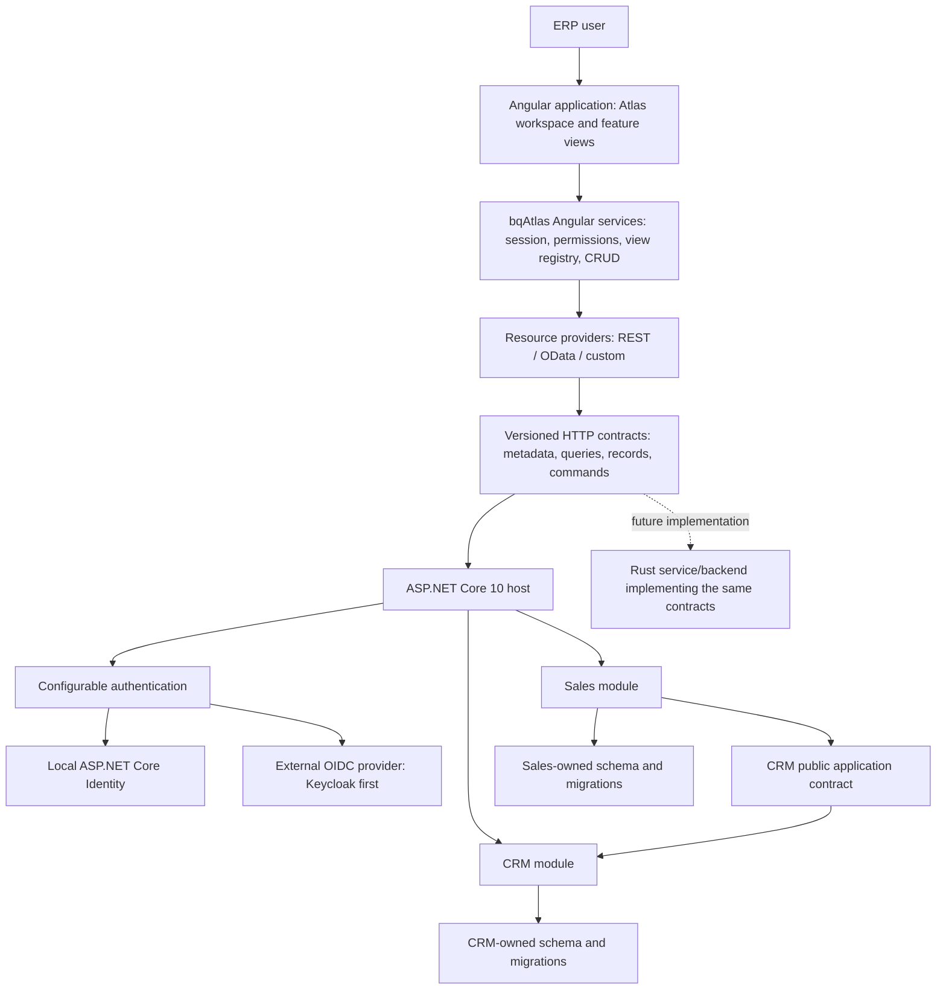

# bqAtlas — architecture and first-release specification

Date: 25 September 2026
Status: accepted implementation direction; the first development increment is tracked in IMPLEMENTATION.md
This document defines the full first-release target. See IMPLEMENTATION.md for what is implemented and verified today.

## 1. Product definition

**bqAtlas is a modular application framework and starter kit for building ERP-style systems.** It combines Atlas's Angular workspace and controls with the useful bqStart concepts of registered views, menus, permissions, metadata-driven forms and fast CRUD development. The first backend implementation is ASP.NET Core 10.

Developers install versioned npm and NuGet packages, generate a working application, add business modules, and scaffold common resource screens. They own the generated application and its business logic. Framework fixes arrive through package upgrades.

This direction supersedes the earlier recommendation to introduce Atlas into the existing PrimeNG application. bqStart is a source of concepts and selectively reusable code; the new frontend uses Atlas. The new application can start on Atlas's Angular 22 baseline without a PrimeNG coexistence requirement or an Angular 21 backport.

Three separate deliverables make up the product:

1. **Framework packages:** reusable backend infrastructure, Angular application services and Atlas components.
2. **Starter template:** an application composition root, local development configuration, module layout and examples that consume those packages.
3. **Scaffolding tools:** generate resources, module registration, permissions, views and tests from a small explicit resource definition.

The framework supplies ERP application infrastructure. Accounting, stock valuation, procurement rules and other business domains remain application modules.

## 2. Requirements and proposed decisions

| Area | User requirement | Proposed first-release decision |
| --- | --- | --- |
| Product | A new bqStart-derived library named bqAtlas | New repository and package family with a deliberate public API |
| Backend | ASP.NET Core 10 | One deployable host composing independently owned business modules |
| Database | SQL Server or PostgreSQL | Both supported template choices, with EF Core provider-specific migrations and integration tests |
| Identity | Built-in authentication during development; optional external providers | ASP.NET Core Identity for local accounts by default; configurable OIDC login with Keycloak as the first external reference |
| APIs | OData and other endpoints | OData query adapter plus REST CRUD and explicit business-command endpoints |
| Frontend | Atlas with bqStart views/menus/security | Standalone Angular components and registered features, views, menus and permission IDs |
| Productivity | Quick CRUD scaffolding | Generic metadata renderers, generated typed configuration and custom-view escape hatches |
| Distribution | npm and NuGet packages, starter kit | A small package set, `dotnet new` template and coordinated preview releases |
| Main workload | ERP applications | Dense keyboard workflows, concurrent records, master/detail transactions, validation and concurrency control |
| Future backend | Rust later | Versioned language-neutral HTTP/JSON contracts and transport-independent Angular data providers |
| Testing | Basic unit tests included | Runnable backend and frontend unit tests in every starter, plus separate framework integration and package tests |

SQL Server and PostgreSQL are both first-release targets. The template accepts an explicit database choice; an application uses one provider per deployment. The default development authentication mode is local ASP.NET Core Identity, so starting the application does not require an external identity server. External OIDC authentication is a separate configuration option.

Proposed initial deployment scope: one organization per deployment. Permission policies expose a place for company/branch and tenant context, but multi-tenant SaaS isolation is a separate feature that must be explicitly designed and tested before being advertised. The framework must not require a shared global business database model.

## 3. System architecture



The host owns configuration, module composition, middleware, session/authentication, observability and deployment. A module owns its domain rules, application operations, persistence, endpoints, permissions and resource metadata. The Angular application composes matching frontend feature registrations.

OData is an endpoint adapter. It does not become the definition of a business module, a mandatory UI dependency or the only route to application operations.

## 4. Package model

Names below are proposed identifiers. Registry availability, ownership and release licensing have not been established.

### npm

| Package | Responsibility | Dependency boundary |
| --- | --- | --- |
| `@bqatlas/contracts` | Portable TypeScript types, contract versions and JSON schema assets | No Angular, OData or .NET dependency |
| `@bqatlas/ui` | Existing Atlas controls, theme and generic workspace, moved into the product family | Angular; no application HTTP/auth dependency |
| `@bqatlas/angular` | Feature/view/menu registries, session and permissions, application shell integration, CRUD renderers and resource providers | Contracts + UI; REST/OData through secondary entry points |
| `@bqatlas/cli` | Resource scaffolding, validation and integration tooling | Development tool; no runtime browser dependency |

Use secondary entry points such as `@bqatlas/angular/crud`, `/data/rest` and `/data/odata` instead of creating a separately versioned package for every service. Separate optional document/PDF assets so adopting basic controls does not require every consumer to configure PDF.js. Exact entry points follow package-consumption tests.

The existing local package is named `@atlas/ui`. Prefer one maintained source tree under the selected public namespace. Any old-name compatibility re-export should be temporary and explicit; do not maintain two independent copies of the controls.

### NuGet

| Package | Responsibility | Dependency boundary |
| --- | --- | --- |
| `BqAtlas.Core` | Resource/permission descriptors and framework application abstractions | No EF Core, OData or identity-provider SDK |
| `BqAtlas.AspNetCore` | Host/module registration, metadata/session endpoints, authorization integration, REST endpoint conventions and error mapping | Core + ASP.NET Core 10; OIDC/JWT support through standard middleware |
| `BqAtlas.Identity` | Optional local-account module, login/account endpoints, Identity persistence and local principal mapping | ASP.NET Core Identity + EF Core; domain modules do not depend on Identity user classes |
| `BqAtlas.EntityFrameworkCore` | Optional persistence integration, query implementation, concurrency and audit helpers | Core + EF Core; database provider selected by the application |
| `BqAtlas.OData` | Bounded OData query exposure over approved module read models | ASP.NET Core adapter; queryable implementation stays server-side |
| `BqAtlas.Templates` | Full-stack `dotnet new` project and module templates | Development artifact; consumes released framework package versions |

A business module is normally application source or an internal module package. It does not need to be a public NuGet package. Domain entities do not have to inherit a framework base entity or a mandatory generic repository.

## 5. Modular monolith rules

The first release is one application process and one deployment. Modules are registered explicitly at startup, with unique IDs, declared dependencies and deterministic initialization. Startup rejects duplicate IDs and dependency cycles. Runtime installation of arbitrary modules is outside the first release.

Use one shared database initially, with module-owned schemas, DbContexts and migrations. A module may reference another module's public contracts; it must not access the other module's DbContext, repositories or internal entity classes. Architecture tests enforce project/namespace dependencies. A reporting projection can combine data through an explicitly owned read model.

Start with one implementation project and one public-contract project per substantial module, using Domain/Application/Infrastructure/Endpoints folders inside the implementation. Split these into additional assemblies only when a real boundary needs enforcement. Avoid multiplying projects solely to satisfy a folder convention.

Each use case owns its transaction. A quote and all quote lines are saved atomically inside Sales. Cross-module calls are explicit application contracts. Reliable asynchronous side effects require an outbox/inbox design when introduced; an in-process event callback is not a durability guarantee. There is no first-release promise of distributed transactions or exactly-once processing.

Module metadata identifies resources by stable public IDs such as `crm.customers`, not CLR class names. Endpoints are versioned and module-specific, for example `/api/v1/crm/customers` and `/odata/v1/crm/Customers`.

### SQL Server and PostgreSQL support

Use the Microsoft SQL Server EF Core provider or Npgsql's PostgreSQL EF Core provider, aligned with EF Core 10. Both provider implementations are available; exact supported server and package versions are pinned during implementation. [SQL Server provider](https://learn.microsoft.com/en-us/ef/core/providers/sql-server/), [Npgsql EF Core 10](https://www.npgsql.org/efcore/release-notes/10.0.html)

The common framework package stays provider-neutral. The generated host references the selected provider and migration assemblies. Each persisted module, including local Identity, has separate SQL Server and PostgreSQL migration sets/model snapshots. EF tooling generates migrations for the active provider, so every shared model change must be reflected in both sets. [EF Core multiple-provider migrations](https://learn.microsoft.com/en-us/ef/core/managing-schemas/migrations/providers)

Keep provider-specific configuration at the persistence boundary: generated keys, decimal precision, timestamps, collations, indexes and query translation. Use a common opaque concurrency-token contract; SQL Server `rowversion` or PostgreSQL system columns must not become public DTO requirements. An application-managed concurrency token is the simplest initial shared implementation.

Test CRUD, Identity storage, filter/sort semantics, concurrency, decimal/date round-trips and aggregate transactions against both real engines. Define text-search case behavior explicitly rather than inheriting conflicting database defaults. Provider selection does not promise live database switching or automatic data transfer; migration between engines is a separate operational task.

## 6. Identity and application security

### Local and external modes

**ASP.NET Core Identity remains supported in .NET 10.** It supplies users, password management, roles, claims and account workflows, with EF-backed storage available for the starter. [ASP.NET Core Identity](https://learn.microsoft.com/en-us/aspnet/core/security/authentication/identity?view=aspnetcore-10.0)

| Mode | Authentication | Starter behavior |
| --- | --- | --- |
| `local` | ASP.NET Core Identity and its application cookie | Default for development; Atlas login UI, local users/roles and selected SQL Server/PostgreSQL store; no Keycloak dependency |
| `oidc` | External OIDC provider and a backend-managed browser session | Configure authority, client registration and claim mapping; Keycloak is the first reference provider |

Both modes produce the same bqAtlas current-user, permission and session contracts. The frontend queries enabled login methods and presents a password form or provider redirect. Business modules depend on a bqAtlas principal abstraction, not `IdentityUser`, provider-specific claims or a particular authentication scheme. The host explicitly selects the mode; an unavailable OIDC provider must not silently activate local login.

Local mode uses standard `UserManager`/`SignInManager` behavior for password verification, lockout and session validation. Expose controlled login/logout/change-password and reset/confirmation flows through the optional Identity module. Public self-registration is disabled by default for the ERP template; development account creation uses an explicit development-only bootstrap with a supplied or generated password. A local development email sink can exercise reset/confirmation, while a real email sender is application configuration. Local authentication can also serve a deployment that chooses it; development bootstrap accounts/settings are not automatically enabled there.

The first browser flow uses HttpOnly cookies with CSRF protection for state-changing requests. .NET's Identity APIs support cookie authentication, but their optional built-in bearer tokens are proprietary, not standard JWTs or an OAuth/OIDC authorization server. bqAtlas does not use those tokens as its portable API contract. No embedded OpenIddict/Duende server is required for local development login. [Identity APIs for SPAs](https://learn.microsoft.com/en-us/aspnet/core/security/authentication/identity-api-authorization?view=aspnetcore-10.0)

For external user login, use **OpenID Connect**, with OAuth 2.0 for delegated API access. OAuth 2.0 alone does not define the user identity contract. OAuth-only providers need a suitable ASP.NET authentication handler or an identity broker. This is extensible provider support, not a claim that every provider works without configuration. [OpenID Connect specification](https://openid.net/specs/openid-connect-core-1_0.html)

In external mode, ASP.NET Core performs OIDC Authorization Code + PKCE and the browser receives an HttpOnly session cookie. The server keeps any provider access/refresh tokens out of application JavaScript, with server-side ticket/token storage when tokens are retained. Session expiry and logout use the same frontend contract as local mode. This follows the BFF approach described in Microsoft's OIDC guidance. [ASP.NET Core OIDC guidance](https://learn.microsoft.com/en-us/aspnet/core/security/authentication/configure-oidc-web-authentication?view=aspnetcore-10.0)

API clients can use a separately configured bearer scheme. Validate issuer, audience, expiry and signing keys; opaque tokens require an explicitly supported introspection adapter. Define which endpoints accept cookie or bearer authentication instead of depending on ambiguous scheme defaults. UI API requests receive structured 401/403 responses; interactive login is an explicit redirect. [ASP.NET Core bearer authentication](https://learn.microsoft.com/en-us/aspnet/core/security/authentication/configure-jwt-bearer-authentication?view=aspnetcore-10.0)

Keycloak is supplied as an optional development/integration-test profile and tested first for external mode. Provider configuration includes authority, client registration, scopes, logout behavior and claim mapping. The public framework does not require `keycloak-js`, Keycloak realm roles or an embedded identity server. Validate a second OIDC provider/profile before claiming tested multi-provider support.

Separate three concepts:

- **Identity:** local users have stable local IDs; external users are identified by issuer + subject. Both map to stable application actor IDs. Email is not an automatic account-linking key.
- **Application permissions:** stable names such as `crm.customers.read`, `crm.customers.create`, `sales.quotes.edit` and `sales.quotes.submit`. An application maps provider roles/claims and local assignments to these permissions.
- **Resource policy:** record state, field access and company/branch scope can further restrict an otherwise permitted operation.

The frontend uses effective capabilities to show menus and commands. The backend checks the same permissions and resource policies for every operation, including lookups, counts, exports and OData expansion. Writable DTOs explicitly allow fields; hidden or read-only UI controls are not an authorization boundary. Sensitive fields must be excluded before responses leave the server.

Local password/account capabilities belong only to the optional Identity module. External mode delegates credential management to the provider; provider-administration tools are outside the first release. A mode change preserves assignments/audit identity only through an explicit account mapping or migration. Session changes invalidate permission caches and dispose tasks from the previous identity.

## 7. Portable API contracts

A repository-level `contracts/` directory owns versioned JSON schemas, OpenAPI documents and shared fixtures. .NET and TypeScript models implement these public contracts. CI checks both serialization and behavior against the same fixtures. Rust support will be another implementation of this boundary.

| Contract | Minimum contents |
| --- | --- |
| Application manifest | Contract version, available modules/resources, feature capabilities and localization references |
| Resource descriptor | Stable ID, key schema, field types, validation hints, permitted query fields/operators, relationships and available operations |
| Session/capabilities | Identity summary, effective application permissions, context and session state; no provider tokens |
| Query request/result | Paging, ordered sorting, typed filter tree, search policy, records, optional count and continuation information |
| Record envelope | DTO, opaque concurrency token and record-specific action capabilities |
| Mutation result | Saved representation, updated key/version and relevant business result |
| Error | Problem Details fields, stable application code, field/line validation paths and correlation ID |
| Lookup | Typed search/paging request and lightweight key/label/column records |

Use semantic types such as `string`, `boolean`, `integer`, `decimal`, `date`, `dateTime`, `enum` and `reference`. Avoid exposing `.NET` names such as `Int32`, `ICollection` or assembly-qualified types. Distinguish null, missing and empty values.

Decimal quantities and money use canonical decimal strings at the public contract boundary, with explicit precision/scale and currency where relevant. Values beyond JavaScript's safe integer range also use strings. Date-only values use `YYYY-MM-DD`; instants use ISO 8601 UTC values, with business time zone stored separately where required. Server calculation is authoritative. Atlas's existing number-based controls need adapters or a decimal-safe control before they can promise exact ERP monetary entry.

The frontend resource provider exposes operations equivalent to `query`, `get`, `create`, `update`, `delete`, `lookup` and `executeCommand`. It accepts cancellation and returns normalized data/errors. Views do not construct OData URLs or depend on EF entity tracking.

### REST and OData

The first release supplies canonical REST CRUD for a scaffolded resource, bounded OData reads for list/lookup use cases, and custom command endpoints. OData writes/batch are a later adapter capability, not needed for the first release's CRUD workflow.

- `GET /api/v1/crm/customers/{id}`: retrieve one record.
- `POST /api/v1/crm/customers`: create from an explicit input DTO.
- `PUT /api/v1/crm/customers/{id}`: replace the editable DTO with a concurrency precondition; PATCH can be added with a defined patch contract.
- `DELETE /api/v1/crm/customers/{id}`: delete only where resource policy allows it.
- `POST /api/v1/crm/customers/query`: canonical typed query when a richer filter exceeds simple URL parameters.
- `GET /odata/v1/crm/Customers?...`: opt-in OData query over an approved read model.
- `POST /api/v1/sales/quotes/{id}/submit`: explicit business transition.

These are proposed conventions. In particular, bqStart's existing PATCH-for-create/POST-for-update convention is not the new API default.

All adapters invoke the same application authorization and validation boundary. OData fields, filter operators, expansion depth, query complexity and page sizes are restricted per resource, with stable ordering. Do not inherit bqStart's unrestricted `SetMaxTop(null)` default. Query options are configurable in ASP.NET Core OData; exact supported behavior must be integration-tested against the chosen package version. [OData query options](https://learn.microsoft.com/en-us/odata/webapi-8/fundamentals/query-options)

Concurrency is explicit: an opaque version/ETag returned on read is required for edits/deletes, including header/line aggregate saves. A failed precondition returns 412 and leaves the user's draft intact; other business-state conflicts use 409. Expected validation and server errors map into the same view-level error model. ASP.NET Core supplies Problem Details infrastructure for the REST adapter. [API error handling](https://learn.microsoft.com/en-us/aspnet/core/fundamentals/error-handling-api?view=aspnetcore-10.0)

Endpoint retries must not duplicate business actions. For first-release quote submission, store an idempotency key/result with the state change, scoped to the operation and authenticated application context. General durable job processing remains a later feature.

## 8. Frontend application model

`@bqatlas/ui` remains useful on its own. `@bqatlas/angular` adds the application conventions that were useful in bqStart.

| Concept | bqAtlas behavior |
| --- | --- |
| Feature/module registration | Contributes local view implementations, menu nodes, commands and resource-provider bindings |
| View definition | Stable `viewId`, resource ID, mode, title/icon, permission and component factory or generic renderer |
| Menu definition | Nested groups, ordering, localization keys, view/command targets and visibility requirements |
| List view | Server paging/sorting/filtering, selection, actions, retry state and saved-query extension point |
| Record view | New/edit/details modes, metadata fields, server errors, dirty baseline, awaitable save and concurrency conflicts |
| Workspace task | Independent draft, form/providers, loading, shortcuts and close lifecycle |
| Custom view | Ordinary Angular component using the same task, permissions and data-provider services |

Presentation descriptions are data. Angular component factories remain in trusted local feature code, selected through an allowlisted renderer/view registry. Server metadata never contains executable JavaScript or arbitrary component import URLs.

Separate resource metadata from presentation configuration. Resource metadata owns types, allowed operations and validation hints; view configuration owns layout, columns and renderer choice. Permissions further constrain both. Simple resources use a generic renderer, while complex ERP screens combine reusable controls and application logic.

Use composition and injectable stores/services for new screens instead of requiring all features to inherit large base classes. The corresponding concepts are a list controller, a record draft controller, resource provider and explicit lifecycle hooks. Existing bqStart components are reference material rather than runtime dependencies.

A list is normally a singleton task; existing-record tasks are keyed by view/mode/resource/key; new-record tasks receive a unique draft key. Task switching retains instances. Save completion targets the originating task. Scoped providers, namespaced DOM IDs and active-task command dispatch prevent the cross-window issues found in bqStart.

Required shell work beyond the current Atlas prototype includes deep links, deliberate browser Back behavior, close-all/workspace exit guards, session cleanup, consistent error boundaries and coordinated modal/focus ownership. Compact desktop windows and the mobile stack must share the same business stores and operations.

For initial CRUD forms, qualify one consistent form-state implementation. Atlas currently has both CVA and Signal Forms controls; adapter code must normalize validity, touched/dirty state and asynchronous saves. Keep framework consumers insulated from unqualified experimental form APIs, and preserve Angular standalone and zoneless behavior through actual async tests.

## 9. Scaffolding experience

The starter is a NuGet template package that generates both backend and Angular application files. .NET templates support installation from a NuGet feed or local package. [Template packaging](https://learn.microsoft.com/en-us/dotnet/core/tutorials/cli-templates-create-template-package)

Proposed developer experience, not currently available commands:

```sh
dotnet new install BqAtlas.Templates
dotnet new bqatlas -n AcmeErp --database sqlserver --auth local
dotnet new bqatlas-module -n Inventory
npx @bqatlas/cli generate crud --spec resource-specs/inventory/product.resource.json
```

The proposed database choices are `sqlserver` and `postgresql`; authentication choices are `local` (default) and `oidc`. For example, `--database postgresql --auth oidc` generates the external-provider configuration. Basic backend/frontend test projects are included for either choice.

A resource specification includes its module/resource IDs, keys, editable fields, validation, relationships, permissions and list/form defaults. Start from an explicit descriptor rather than automatically publishing every database table. Optional .NET attribute/reflection authoring can produce the same neutral descriptor later.

The generator creates:

- Backend input/output DTOs, application handlers/validation hooks, endpoint registration, resource descriptors and policy declarations.
- Optional EF mapping/configuration hooks; migrations are a reviewed application artifact rather than an implicit generator side effect.
- Typed Angular resource bindings, list/form configuration, menu/view registration and extension components where needed.
- Runnable baseline validation/permission/CRUD unit tests and representative fixtures, plus extension examples for application-specific rules.

Generated files and user-owned extensions have distinct ownership. The tool previews changes, refuses to overwrite edited user files and produces deterministic output. Regeneration must not destroy custom validation or business rules. Support dry-run and a recorded generation manifest before advertising regeneration as safe.

A framework upgrade updates installed packages. It does not regenerate an entire application or overwrite feature code. Breaking changes require migration notes and, where worthwhile, automated migrations; Angular schematics are an available mechanism for Angular-side source transformations. [Angular schematics](https://angular.dev/tools/cli/schematics)

## 10. Repository and generated application

Proposed framework monorepo:

```text
bqatlas/
  contracts/                 JSON schemas, OpenAPI and cross-language fixtures
  frontend/
    projects/contracts/      @bqatlas/contracts
    projects/ui/             Atlas controls and workspace
    projects/angular/        Application services, CRUD and data adapters
    tools/cli/               Scaffolding
  backend/src/
    BqAtlas.Core/
    BqAtlas.AspNetCore/
    BqAtlas.Identity/
    BqAtlas.EntityFrameworkCore/
    BqAtlas.OData/
  templates/                 dotnet new templates and package project
  samples/erp/               Reference consumer with CRM and Sales modules
  tests/                     Contracts, package consumers, E2E and architecture
  docs/                      Guides, decisions and release notes
  eng/                       Build, pack and release scripts
```

Generated application:

```text
AcmeErp/
  server/
    Host/                    Composition root, configuration, session and hosting
    Modules/CRM/             Contracts + implementation, own EF context/migrations
    Modules/Sales/           Contracts + implementation, own EF context/migrations
  client/
    src/app/shell/
    src/app/features/crm/
    src/app/features/sales/
  resource-specs/             Inputs to the scaffolder
  tests/
    Server.UnitTests/        Fast backend tests; no database/identity server
    Server.IntegrationTests/ Selected database and host/auth integration
  deploy/local/              Selected database; optional Keycloak profile
  README.md
```

Generated applications consume packed/published packages. Their build must not rely on source paths into the framework repository. The reference consumer should exercise that same path in CI. Pin compatible versions and maintain an explicit SDK/Angular/Node/database/provider support matrix.

## 11. First release: 0.1 developer preview

The release is a working framework slice with honest preview status. It must demonstrate the whole developer journey, including package installation, rather than just a gallery or a collection of generic base classes.

### Included

| Workstream | Required outcome |
| --- | --- |
| Packages | Installable npm libraries, backend NuGet packages and a template package |
| Template | Generate and run a full-stack app from packed artifacts in a clean directory |
| Host/modules | .NET 10 composition, dependency validation, module-owned persistence and architecture checks |
| Database | SQL Server and PostgreSQL template choices, separate migrations and real-provider integration coverage |
| Login | Local Identity login/logout/account flows by default; optional OIDC with a Keycloak reference profile; consistent session behavior |
| Permissions | Stable operation permissions and server enforcement, reflected in menus/actions |
| CRUD | Customer list/create/details/edit/delete, typed lookup, validation and optimistic concurrency |
| APIs | REST CRUD/commands and bounded OData reads over the same authorized application model |
| Workspace | Multiple retained tasks, correct dirty-close and save-failure behavior, task-scoped shortcuts and mobile stack |
| ERP example | CRM Customers + Sales Quotes with lines, customer lookup, decimal-safe values, server totals and submit action |
| Audit | Successful write actor/time and business operation records, committed with the transaction; no blanket sensitive-payload logging |
| Scaffolding | Generate an additional simple resource and register its backend, views, menu and permissions |
| Unit tests | Executable backend and Angular unit tests included in every generated starter and newly scaffolded resource |
| Documentation | Quickstart, module authoring, custom views, identity setup, contracts and package upgrade guidance |

Customer and quote examples prove different needs. The customer screen proves quick metadata CRUD. The quote proves a custom aggregate workflow, line validation, transactional save, cross-module lookup and an explicit business transition. Quote totals are an illustrative business rule with a defined rounding policy, not a general tax/accounting engine.

### Deferred

Rust implementation; database support beyond the qualified SQL Server/PostgreSQL versions; broad external-provider certification; full multi-tenant SaaS; distributed modules; durable workflow/job engine; accounting/inventory applications; offline synchronization; arbitrary runtime plugins; full spreadsheet editing/virtualization; report designer; advanced document management; and automatic migration of existing bqStart applications.

These remain extension paths. Their absence must not be hidden behind framework names or generic interfaces.

### Acceptance scenarios

1. Pack the release artifacts, install the template into an isolated template-engine environment, and generate a clean application. Restore/build/run without a checkout of framework source.
2. Run local Identity login/logout on each supported database without Keycloak. Separately select OIDC and test Keycloak login/logout. In both modes, expired sessions return a controlled state and clear prior-user workspace data; permissions apply consistently.
3. Test a permitted user and a read-only user against both REST and OData. Direct endpoint calls, lookup/count queries and expanded records must enforce the same policy as the UI.
4. Scaffold a simple resource and perform CRUD without writing a custom list or record component. Add a custom field renderer/validation hook without editing framework internals.
5. Open two customers and two new quote drafts. Reopening an existing record activates its draft; Ctrl+S affects only the active task; background completion never closes another task.
6. Reject invalid and stale saves; keep drafts and focus the relevant header/line errors. Cancelling close keeps edits. Save-and-close waits for the server result.
7. Save a quote and its lines atomically. A failed line leaves no partial persisted changes. Repeat a submit request with the same idempotency key and observe one business transition.
8. Query a realistic server dataset without loading it all into the browser. Exercise paging, sort/filter whitelists, cancellation and a remote customer lookup. Publish measured limits for rendered datasheet rows/tasks instead of claiming arbitrary scale.
9. Exercise keyboard-only operation, popup focus/ownership, narrow screens and the mobile task stack in browser automation. Run accessibility checks plus manual review of the main workflow.
10. Run shared contract fixtures through REST and OData adapters. Keep view code unchanged when the reference resource switches adapters; custom providers implement the same frontend interface.
11. Run the starter's backend and Angular unit-test commands without a database, Docker or identity provider. Deliberately break one sample business rule and verify that the corresponding test fails. Run migrations and integration checks separately against both databases, including local Identity storage.

## 12. Tests shipped with the starter

Basic unit tests are part of the generated application, not only the framework's internal build. Propose xUnit for .NET and Angular TestBed with Vitest for frontend tests; Angular's current CLI testing setup supports Vitest. Keep Atlas's existing useful regressions while integrating them into the shared test commands. [Angular testing](https://angular.dev/guide/testing)

| Layer | Representative tests | Infrastructure |
| --- | --- | --- |
| Backend unit | Customer validation, quote totals/rounding, allowed state transitions, permission mapping, module dependency validation | In-process fakes for application boundaries; no database or IdP |
| Frontend unit | Metadata field validation, menu permissions, draft isolation, failed-save retention, active-task commands and query mapping | Angular test utilities, fake providers and controlled async results |
| Database integration | Both migration sets, Identity storage, REST/OData queries, stale-write rejection and transactional quote saves | Real SQL Server/PostgreSQL service or suitable disposable test instance |
| Auth/HTTP integration | Local sign-in/cookie/session behavior, CSRF checks, 401/403, external OIDC redirect/callback and claim mapping | Test host; Keycloak only for the external-provider suite |
| Small browser suite | Login, customer CRUD, dirty-close and quote line editing | Running sample app and supported browser |

The quickstart exposes `dotnet test` for the unit-test project/filter and `npm test` for non-watch frontend tests; integration and browser tests have separate documented commands. CI runs fast unit tests on each change and gates releases on the database/auth/package matrix. Do not impose a coverage percentage as a substitute for meaningful behavioral assertions.

Use injectable clocks, IDs and resource-provider interfaces where tests need determinism. Test bqAtlas's account/permission integration rather than reimplementing password-hasher tests. Scaffolded tests include at least a valid case, an invalid case and a permission denial where applicable, not merely component construction or getter/setter assertions.

Real-provider tests are required to claim support for both databases. EF InMemory or SQLite substitutes do not validate SQL Server/PostgreSQL query, transaction or collation behavior. CI should use suitable runners or database services without requiring every developer machine to host both engines. [EF Core testing strategy](https://learn.microsoft.com/en-us/ef/core/testing/choosing-a-testing-strategy)

## 13. Delivery milestones

| Milestone | Concrete output | Exit condition |
| --- | --- | --- |
| M0: contract and package foundation | Repository layout, names/version policy, contract schemas and Atlas source transfer | Packages build; a minimal external consumer imports the UI and contracts |
| M1: running starter | .NET host, module registration, database selection, local Identity, optional OIDC and Atlas shell | Generated app signs in in either auth mode; local Identity works on both databases; baseline unit tests pass |
| M2: metadata CRUD | Customer resource, REST/OData adapters, generic list/form, lookup and concurrency | Both databases pass query/CRUD integration cases; generated feature unit tests pass |
| M3: ERP workflow | Sales quote aggregate, task lifecycle, decimal-safe entry and submit command | Multi-window and transactional acceptance scenarios pass |
| M4: developer tooling and preview | CRUD generator, template pack, clean-consumer tests and documentation | Installable 0.1 preview artifacts reproduce the demonstrated workflow |

Estimates should follow M0 validation of the Atlas extraction and contract prototypes. A source gallery passing tests is not sufficient evidence to estimate production qualification or a complete ERP framework.

## 14. Packaging and release policy

Begin with coordinated prerelease versions such as `0.1.0-alpha.1` across framework packages and the template. Record the exact compatible combination in a release manifest. API/metadata contract versions are explicit and evolve separately from package patch versions; breaking changes require a new supported contract version or a documented major migration.

CI builds and tests first, then creates npm tarballs and NuGet packages. Test consumers against those artifacts, not only project references. Check public exports, CSS/assets, declaration files, required peers, source maps where appropriate, NuGet dependencies and template substitutions. Include license/notice files, source/repository metadata, symbols/Source Link where configured and provenance appropriate to the registry.

The release matrix covers SQL Server/local Identity, PostgreSQL/local Identity, SQL Server/OIDC and PostgreSQL/OIDC. Generate/build/smoke-test all four combinations, exercise real local Identity persistence on both databases and run the reference external-provider flow. Authentication and database failures must remain visible rather than being hidden by a test-only default configuration.

Publish only artifacts that passed consumer tests, then verify installation from the target registry. Coordinate ordering so a template never references versions that are unavailable. Publishing across npm and NuGet is not atomic; a release manifest is marked usable only after the complete set is available. Fix releases with a new version rather than replacing already-published artifacts.

Before the first public release, resolve npm scope/NuGet ownership, product license and notices inherited from reused code. No package name has been reserved and no package has been published as part of this specification.

## 15. How Rust fits later

The Rust backend can implement the same session/permission/resource/record/command contracts and pass the same fixtures. It may use its own ORM, domain patterns and module runtime. The Angular views remain unchanged when the resource-provider contract remains satisfied.

Do not require Rust to implement all of OData to join the ecosystem. Canonical REST/query contracts are sufficient; the frontend selects the REST provider. OData remains an optional capability. A gradual replacement can route selected module endpoints to a Rust service while the .NET host continues handling the browser session, provided ownership and authorization are preserved.

Portability does not make implementation free: business rules, transactions, authorization, concurrency semantics, decimal behavior and data migrations still need to be reproduced and qualified. NuGet packages remain .NET-specific. No Rust runtime abstraction or Rust package is required in the first release.

## 16. Reuse and remaining decisions

Carry forward from Atlas: generic workspace, controls, scoped theme, datasheet navigation, task identity and the existing regression suite. Harden missing route/session/modal behavior and monetary entry through the new reference application.

Carry forward from bqStart: view/menu registration ideas, field metadata, resource permissions, relationship navigation, CRUD conventions and entity-change notifications. Replace the coupling to CLR type names, one global form context, synchronous-looking asynchronous saves, shared shortcuts, identity-specific base types and OData-only controller inheritance.

Keep the old repositories usable during extraction; the new repository becomes the maintained source for any transferred library code. Preserve original attribution and license obligations. A migration guide for bqStart consumers can follow after bqAtlas's APIs stabilize.

SQL Server and PostgreSQL support, local Identity development authentication, optional external authentication and basic unit tests are confirmed requirements. The template accepts an explicit database choice; no database preference needs to block the architecture.

Open product decisions:

- Deployment scope: one organization per deployment proposed; decide multi-company/tenant requirements before implementing data isolation.
- Public registry identities, source repository location and licensing before release.
- Exact stable dependency versions and supported browser matrix at implementation kickoff; the current Atlas baseline is Angular 22.1.7.

This specification supersedes the integration path in [the earlier study](ATLAS-UI-INTEGRATION-STUDY.md). That study remains useful as a record of the existing code and its limitations.
